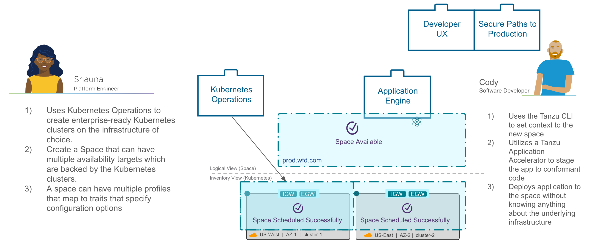

**Welcome to the Tanzu Application Engine workshop!**

VMware Tanzu Application Platform provides platform engineers and operators the tools to build and manage application development environments, and for application developers to easily deploy their apps into production.

kpack makes it very easy to build and maintain images securely and repeatably, over time and at scale!

In this workshop, you will use kpack to:
- Setup Infrastructure
- Create Application Environment
- Deploy your first application
- Increate application resilience

